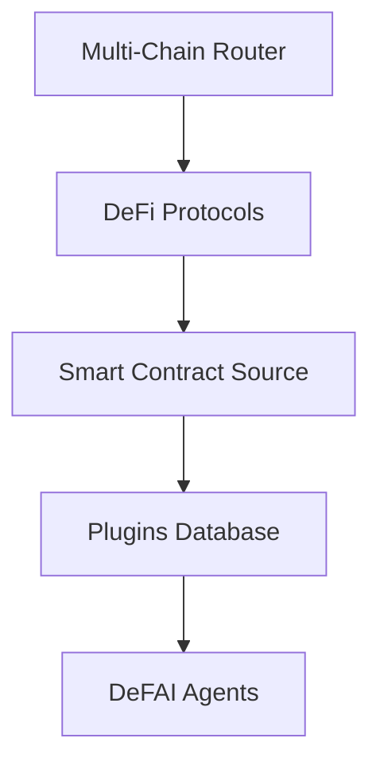

# 🚀 DeFAI Protocol

> 🌉 Bridging DeFi protocols with AI agents for true on-chain operations

<p align="center">

 
</p>

## 🌟 Overview

DeFAI Protocol is an open-source framework by TermiX that enables seamless integration between DeFi protocols and AI agents. It provides a robust infrastructure for creating blockchain-agnostic agent solutions that can interact with any DeFi protocol.

## ✨ Key Features

- 🔗 **Multi-Chain Support**: Built-in router for cross-chain DeFi operations
- 🔌 **Plugin Architecture**: Extensible system for integrating any DeFi protocol
- 📜 **Smart Contract Integration**: Direct interaction with protocol source code
- 🤖 **Eliza Framework Compatibility**: Seamless integration with AI agents
- ⛓️ **True On-Chain Operations**: Direct blockchain interaction without intermediaries

## 🏗️ Architecture

The DeFAI Protocol consists of several key components:
1. 📚 **Plugin Database**: Repository of supported DeFi protocol integrations
2. 🔄 **Multi-Chain Router**: Handles cross-chain protocol execution
3. 🛠️ **Protocol Compiler**: Transforms DeFi protocol instructions into agent-compatible operations
4. 🧠 **RAG System**: Retrieval-Augmented Generation for intelligent protocol interaction

## 🔄 Integration Flow


## 👩‍💻 Developer Resources

- 🔧 Add custom DeFi protocol plugins
- 🤝 Integrate with the Eliza Framework
- 🎨 Build interactive applications using DeFAI Canvas
- 📚 Access documentation and examples

## 🚀 Getting Started
[Documentation and integration guides coming soon]


## 💬 Contact & Support

- 📧 Email: [contact@termix.ai]
- 💻 GitHub Issues
- 🌐 Discord Community:[TermiX AI](https://discord.gg/DPtWHJ3a)
- 📱 Twitter: [@termix_ai]


<p align="center">
  Built with 💜 by TermiX Team
  <br/>
  <a href="https://twitter.com/termix_ai">Twitter</a> •
  <a href="https://discord.gg/DPtWHJ3a">Discord</a> •
  <a href="https://termix.ai">Docs</a>
</p>
```


